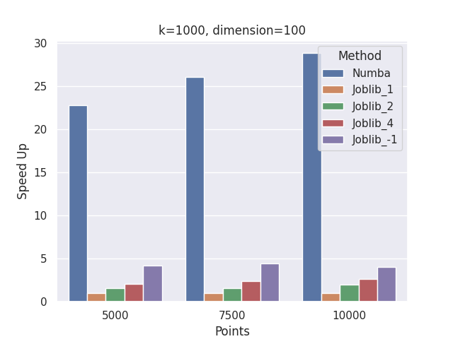

# Parallel K-means Implementation Examples

## Overview

The goal of this final project is to demonstrate various implementations and performance comparisons of the K-means clustering algorithm using two powerful libraries: `joblib` and `numba`. Both libraries facilitate parallelization on the CPU, but they do so in different ways.

## Libraries

- **Joblib**: This library creates multiple processes to bypass the Global Interpreter Lock (GIL) in Python. By utilizing separate processes, `joblib` can effectively distribute the workload across multiple CPU cores, leading to improved performance for CPU-bound tasks.

- **Numba**: In contrast, `numba` compiles Python code into machine code at runtime, allowing it to execute without the overhead of the Python interpreter. This Just-In-Time (JIT) compilation can significantly speed up numerical computations, making it a great choice for performance-critical applications.

## Objectives

1. **Implementation**: Provide clear examples of how to implement K-means clustering using both `joblib` and `numba`.
2. **Performance Comparison**: Analyze and compare the performance of both implementations under various conditions and datasets.
3. **Visualization**: Include visualizations to illustrate the clustering  performance metrics (time).

## Getting Started

To run the examples in this project, ensure you have the dependencies installed:

```bash
pip install -r requirements.txt
```

The [output.txt](output.txt) contains the result of a run with the following hardware:

```
CPU(s):                   16
  On-line CPU(s) list:    0-15
Vendor ID:                AuthenticAMD
  Model name:             AMD Ryzen 7 8845HS w/ Radeon 780M Graphics
    CPU family:           25
    Model:                117
    Thread(s) per core:   2
    Core(s) per socket:   8
    Socket(s):            1
    Stepping:             2
    CPU(s) scaling MHz:   14%
    CPU max MHz:          5137.0000
    CPU min MHz:          400.0000
Caches (sum of all):      
  L1d:                    256 KiB (8 instances)
  L1i:                    256 KiB (8 instances)
  L2:                     8 MiB (8 instances)
  L3:                     16 MiB (1 instance)
NUMA:                     
  NUMA node(s):           1
  NUMA node0 CPU(s):      0-15
```

## Results

A speed up plot can be found in below:

 `Numba` speedup is way higher than `joblib`.
 For reference we include just the `joblib` speed up.
 
